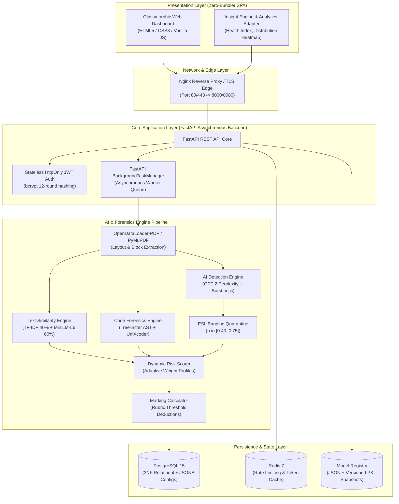

# AcademicGuard — Comprehensive Technical Documentation
## Blockchain Olympiad Bangladesh (BCOLBD 2026) — Artificial Intelligence Track (AInspire)

> **Document Type:** Official Competition Technical Documentation & Model Specification  
> **Evaluation Criteria:** Final Round — Technical Documentation & Code Repository (40 Points Total)  
> **Team Name:** `AcademicGuard` | **Team ID:** `6a7f5c7d71ee7`  
> **Institution:** Department of Computer Science & Engineering, University of Information Technology and Sciences (UITS), Dhaka, Bangladesh  
> **Version:** 4.3 (Production & Local Inference Verified)  

---

## Executive Summary

**AcademicGuard** is an on-premise, privacy-preserving academic integrity and automated grading platform engineered to address the **Academic Integrity Trilemma** (exorbitant foreign currency SaaS cost, severe English-as-a-Second-Language bias, and institutional data privacy vulnerabilities). Designed for commodity x86/ARM CPU infrastructure with zero external cloud dependencies, AcademicGuard combines:

1. **Document Structure Extraction:** High-accuracy layout parsing with **OpenDataLoader-PDF** (XY-Cut++ layout analysis, tabular reconstruction, and native code fencing) with PyMuPDF fallback.
2. **Hybrid Semantic Text Similarity:** Dense embedding similarity via `all-MiniLM-L6-v2` fused with lexical TF-IDF cosine similarity.
3. **Compiler-Grade Code Forensics:** Multi-language Abstract Syntax Tree (AST) token parsing via **Tree-Sitter** coupled with **UniXcoder** neural code representations to defeat semantic refactoring, variable renaming, and logic obfuscation.
4. **Research-Validated AI Detection:** Token-level log-likelihood evaluation (**GPT-2 Perplexity**), sentence-level perplexity variance (**Burstiness**), and vocabulary entropy (**Stylometry**).
5. **Algorithmic Confidence Threshold Banding:** A protective quarantine zone ($p \in [0.40, 0.75]$) that prevents automated grade deductions on borderline or false-positive-prone submissions from non-native English (ESL) students.
6. **Dynamic Risk Scoring & Automated Marking:** Adaptive weight profiles (`TEXT_ONLY` vs `CODE_PRESENT`) driving configurable rubric-based mark deduction templates.
7. **Continuous Active Learning:** Human-in-the-loop retraining engine that captures faculty overrides, updates local scikit-learn classifiers, and manages versioned snapshots in a structured **Model Registry**.

---

## 1. System Architecture & Component Interactions



### Architectural Highlights:
- **Zero Cloud Leakage:** All inference tensors (embeddings, perplexities, AST tokens) run locally on premises. No student intellectual property is ever sent to third-party APIs.
- **Asynchronous Batch Processing:** Uploading batches of up to 60 PDFs executes concurrently through Python asyncio background tasks without blocking client HTTP request/response lifecycles.
- **Micro-Memory Footprint:** Optimized quantization and lightweight transformer architectures (`all-MiniLM-L6-v2` at ~80MB, GPT-2 small at ~500MB) allow full concurrent execution on 8GB to 16GB RAM commodity machines without requiring dedicated GPUs.

---

## 2. Multi-Modal Pipeline Specifications


### 2.1 Stage 1: Document Parsing & Layout Analysis
- **Primary Engine:** `OpenDataLoader-PDF` (`opendataloader-pdf`). Employs **XY-Cut++ spatial layout analysis** to extract structural trees, identify bounding boxes, reconstruct multi-column text flow, and preserve tabular formatting.
- **Fallback Engine:** PyMuPDF (`fitz`) for accelerated plain-text and font-span stream recovery if spatial layout analysis encounters non-standard PDF formats.
- **Dual-Stream Separation:** Extracted document content is automatically separated into **Theory Prose** vs. **Executable Code Blocks** using regex-assisted markdown code fences (```` ```python ````, ```` ```c ````, ```` ```java ````, etc.) combined with indentation and language keyword heuristics.
- **Metadata Extraction:** Deterministic regular expressions parse Student ID (`\b\d{4,16}\b`) and Student Name directly from standardized cover headers.

### 2.2 Stage 2: Hybrid Text Similarity Engine
To prevent evasion via synonym substitution or word reordering while preserving exact quote matching, AcademicGuard fuses lexical and semantic metrics:

$$\text{Sim}_{\text{text}}(A, B) = w_{\text{lex}} \cdot \text{Cosine}(\mathbf{v}_{\text{tfidf}}^A, \mathbf{v}_{\text{tfidf}}^B) + w_{\text{sem}} \cdot \text{Cosine}(\mathbf{e}_{\text{dense}}^A, \mathbf{e}_{\text{dense}}^B)$$

- **Weights:** $w_{\text{lex}} = 0.40$, $w_{\text{sem}} = 0.60$.
- **Lexical Vector ($\mathbf{v}_{\text{tfidf}}$):** Sub-linear term frequency scaling with English stop-word filtering across assignment corpus.
- **Semantic Vector ($\mathbf{e}_{\text{dense}}$):** 384-dimensional dense sentence embeddings generated by `sentence-transformers/all-MiniLM-L6-v2`.

### 2.3 Stage 3: Source Code Forensics & AST Clone Detection
Traditional diff algorithms fail against simple variable renaming and function reordering. AcademicGuard applies compiler-grade parsing:

1. **Tree-Sitter AST Normalization:** Converts C, C++, Java, and Python code into Abstract Syntax Trees. Identifiers and literals are canonicalized (e.g., `temp_val` $\to$ `var0`, `total_sum` $\to$ `var1`), stripping semantic obfuscation while preserving structural syntax.
2. **Subtree Jaccard & Levenshtein Metrics:** Computes normalized edit distance over serialized AST token streams:
   $$\text{Sim}_{\text{AST}}(C_1, C_2) = 1.0 - \frac{\text{Levenshtein}(\text{Tokens}(C_1), \text{Tokens}(C_2))}{\max(|\text{Tokens}(C_1)|, |\text{Tokens}(C_2)|)}$$
3. **UniXcoder Neural Representation:** Evaluates pre-trained cross-modal code embeddings (`microsoft/unixcoder-base`) pre-trained on POJ-104 clone detection benchmarks to identify algorithmic equivalence even across different programming paradigms.

### 2.4 Stage 4: AI Authorship Detection Engine
AcademicGuard evaluates statistical signatures characteristic of auto-regressive language models:

1. **Perplexity (PPL):** Given a token sequence $X = (x_1, x_2, \dots, x_t)$ evaluated through GPT-2:
   $$\text{PPL}(X) = \exp\left( -\frac{1}{t} \sum_{i=1}^{t} \log P_\theta(x_i \mid x_{<i}) \right)$$
   AI-generated text exhibits characteristically low perplexity ($\text{PPL} < 25$), whereas authentic human academic writing displays high, irregular perplexity ($\text{PPL} > 45$).
2. **Burstiness Variance:** Measures sentence-to-sentence perplexity fluctuations:
   $$\text{Burstiness} = \frac{\sigma(\text{PPL}_{\text{sentence}})}{\mu(\text{PPL}_{\text{sentence}})}$$
   Human authors naturally alternate between short, simple sentences and dense, complex structures (high burstiness). LLMs generate uniformly predictable prose across sentences (near-zero burstiness).
3. **Stylometry (Type-Token Ratio & Punctuation Entropy):** Measures vocabulary richness $\text{TTR} = \frac{|V_{\text{unique}}|}{|V_{\text{total}}|}$ and punctuation distribution.
4. **Ensemble Classifier:** Extracted statistical signals feed an adaptive L-BFGS Logistic Regression model (`ai_detector.pkl`) outputting probability $p_{\text{AI}} \in [0.0, 1.0]$.

---

## 3. Algorithmic Confidence Threshold Banding (ESL Equity)

A critical vulnerability in commercial tools (such as Turnitin and GPTZero) is high false-positive rates on non-native English (ESL) writers, whose constrained vocabulary mimics the uniform predictability of LLMs.

AcademicGuard implements **Algorithmic Confidence Threshold Banding**:

```
0.00                    0.40                    0.75                    1.00
|-----------------------|=======================|-----------------------|
       HUMAN ZONE           ESL QUARANTINE ZONE          SYNTHETIC AI ZONE
   [No Mark Deduction]      [Flagged for Review;      [Automated Penalty Eligible]
                           Zero Automated Penalty]
```

- **Confidence Bands:**
  - $p_{\text{AI}} < 0.40$: **Human Authentic** $\to$ High confidence, zero penalty.
  - $0.40 \le p_{\text{AI}} \le 0.75$: **Quarantine Zone** $\to$ Low confidence / Ambiguous. The system **prohibits automated mark deductions**, flags the submission for instructor manual review, and highlights sentence perplexity heatmaps.
  - $p_{\text{AI}} > 0.75$: **High-Confidence AI Generation** $\to$ Confirmed synthetic characteristics; eligible for rubric deductions.

---

## 4. Dynamic Risk Scoring & Automated Rubric Marking

### 4.1 Dynamic Weight Profiles
Assignments vary between pure humanities/theory essays and software development labs. AcademicGuard dynamically selects the scoring formula based on detected content:

- **Theory Only Profile (`TEXT_ONLY`):**
  $$\text{Risk} = 0.55 \cdot S_{\text{AI}} + 0.45 \cdot S_{\text{TextSim}}$$
- **Programming Lab Profile (`CODE_PRESENT`):**
  $$\text{Risk} = 0.40 \cdot S_{\text{AI}} + 0.35 \cdot S_{\text{TextSim}} + 0.25 \cdot S_{\text{CodeSim}}$$

### 4.2 Risk Level Classification
- **LOW:** $\text{Risk} < 0.30$ (Green)
- **MEDIUM:** $0.30 \le \text{Risk} < 0.70$ (Amber)
- **HIGH:** $\text{Risk} \ge 0.70$ (Red)

### 4.3 Rubric Mark Calculation Engine
Instructors configure maximum assignment marks (e.g., 100) alongside penalty thresholds:
$$\text{Penalty}_{\text{total}} = \text{Deduction}_{\text{AI}} + \text{Deduction}_{\text{TextSim}} + \text{Deduction}_{\text{CodeSim}}$$
$$\text{Mark}_{\text{final}} = \max\left(0.0, \text{Mark}_{\text{max}} - \text{Penalty}_{\text{total}}\right)$$

Instructors can save, name, and export custom marking configurations as reusable **Marking Templates** stored in PostgreSQL JSONB.

---

## 5. Model Retraining, Active Learning & Model Registry

AcademicGuard features a continuous feedback loop:
1. **Human Annotation:** When an instructor reviews a submission, they can submit an override label (`is_ai: true/false`, `is_plagiarized: true/false`).
2. **Auto-Trainer (`auto_trainer.py`):** When labeled samples reach the threshold (e.g., $N \ge 20$), the background trainer extracts features, retrains the scikit-learn classifier, and computes ROC-AUC, Precision, Recall, and F1 metrics.
3. **In-Memory Hot-Swapping:** Once validated, the new model pickle (`ai_detector_vYYYYMMDD_HHMMSS.pkl`) is loaded in memory without server restarts.
4. **Versioned Registry:** Managed in `model_registry.json`, providing audit tracking, timestamping, performance history, and instant rollback capabilities.

---

## 6. Reproducibility & Standalone Inference Verification

To enable BCOLBD judges and evaluators to immediately verify all AI models without configuring PostgreSQL or Redis, AcademicGuard includes a dedicated standalone verification script:

```bash
# Execute standalone model verification (runs in ~5 seconds)
python3 quick_inference_demo.py
```

### Verification Capabilities:
1. **AI Detector Test:** Evaluates known human vs. synthetic AI texts, validating Perplexity, Burstiness, Stylometry, and ESL quarantine banding.
2. **Text Similarity Test:** Evaluates identical, paraphrased, and distinct text pairs using TF-IDF and dense embeddings.
3. **Code Forensics Test:** Verifies AST normalization and clone detection on variable-renamed and refactored code snippets.
4. **Dynamic Risk Scoring:** Demonstrates automated transition between `TEXT_ONLY` and `CODE_PRESENT` profiles.

---

## 7. Full-Stack Local Deployment Guide

### Option A: 1-Click Multi-Container Launch (Docker Compose)
```bash
./setup.sh && docker compose up -d --build
```
- **Web Dashboard:** `http://localhost:8080`
- **Backend API & Swagger:** `http://localhost:8000/api/docs`

### Option B: Local Developer Mode
```bash
./run-local.sh
```
Automatically verifies PostgreSQL and Redis containers, activates Python virtual environment, mounts the Vanilla JS frontend on port 8080, and launches the FastAPI async server on port 8000.
